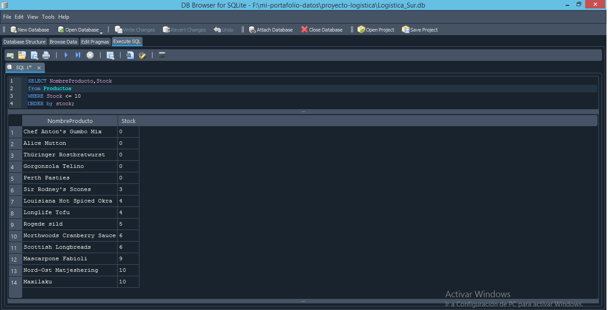
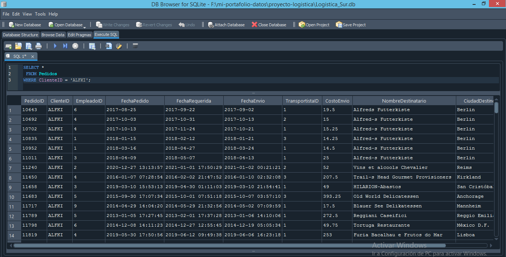
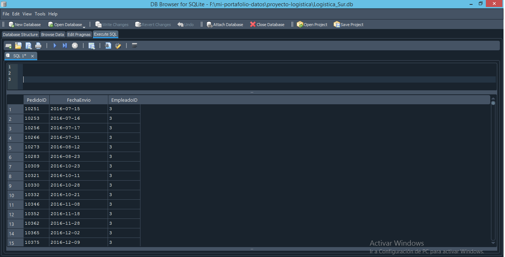
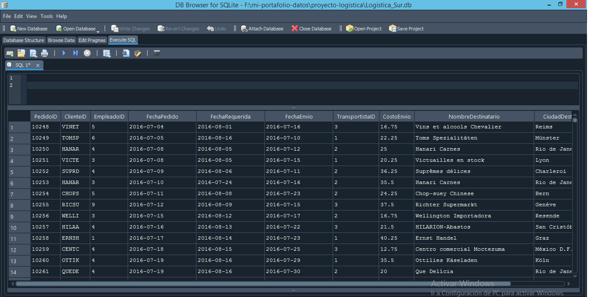
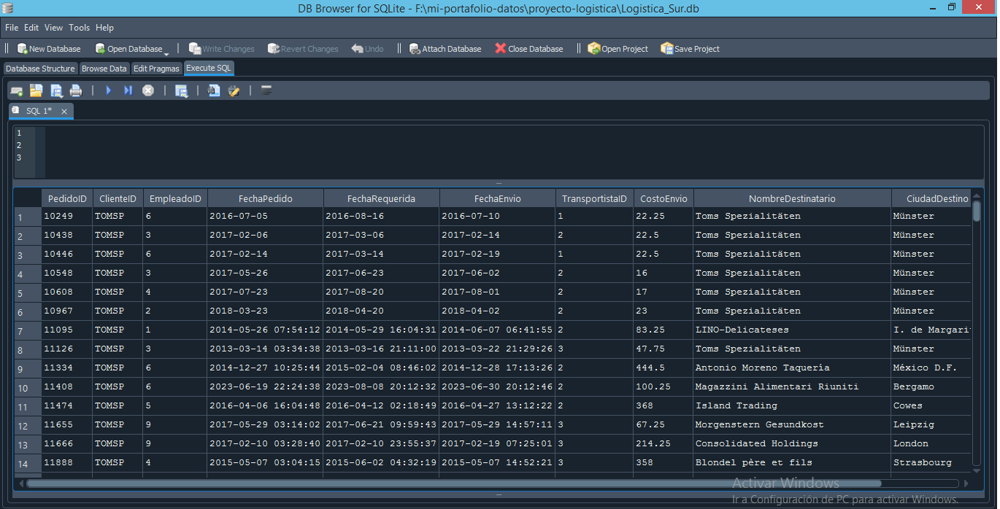
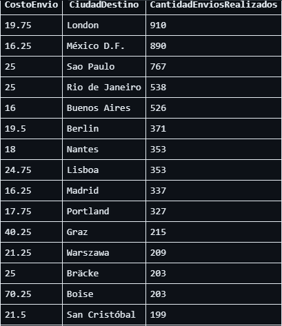

## Ejercicio 1: Control de Inventario
**Objetivo:** Identificar productos con bajo nivel de existencias para evitar quiebres de stock.
**Situación:** El jefe de logística pide un reporte de todos los productos que tienen 10 o menos unidades en inventario.

## Ejercicio 2: Auditoría de Clientes
**Objetivo:** Verificar la integridad de los registros del cliente 'ALFKI' para seguimiento de pedidos.
**Situación:** El departamento de ventas solicita el historial completo de todos los pedidos asociados específicamente al cliente con ID 'ALFKI'.

## Ejercicio 3: Análisis de Desempeño de Personal
**Objetivo:** Identificar la carga de trabajo asignada a un empleado específico para evaluar su gestión operativa.
**Situación:** El jefe de logística requiere un reporte de todos los pedidos procesados por el empleado con ID 3.

## Ejercicio 4: Análisis de actividad temporal
**Objetivo:** Identificar volúmenes de pedidos registrados a partir de una fecha específica.
**Situación:** Se requiere un reporte de todos los pedidos realizados con fecha posterior al '1997-01-01' para analizar el crecimiento de las ventas.

## Ejercicio 5: Filtro avanzado con operadores lógicos
**Objetivo:** Combinar múltiples condiciones para obtener reportes más precisos.
**Situación:** Se solicitó el historial de pedidos del cliente 'TOMSP' posteriores al 1 de enero de 1997 para un análisis de recurrencia.

## Ejercicio 6: Filtro avanzado con operadores de Agrupamiento y Ordenamiento
**Objetivo:** Combinar múltiples condiciones para obtener reportes más precisos.
**Situación:** Se solicitó el que se filtre por cantidad de envios por ciudad y por costo de envio y que se ordene de forma descendente.

